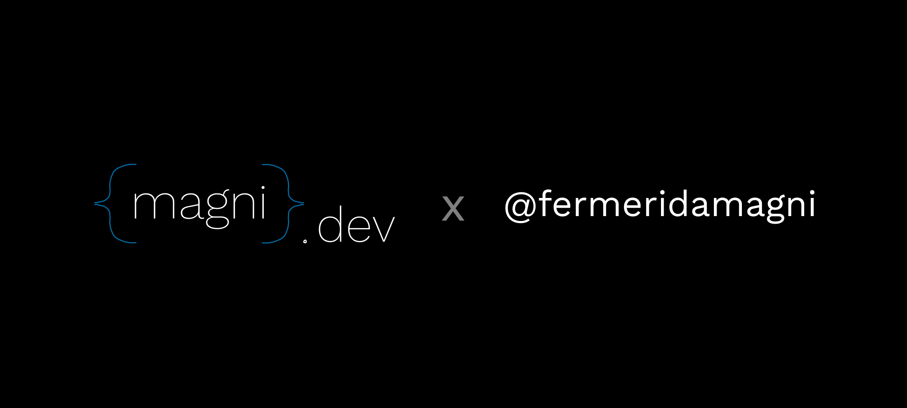

<div align="center">
  
</div>

# Skills Registry by Engineering

A professional and minimalistic registry of engineering skills to empower and extend agentic workflows.

## 🛠️ Available Skills

| Skill | Description | Path |
|-------|-------------|------|
| **`release-publisher`** | Automate releasing packages, apps, and products to GitHub repositories. Handles version bumping, tags, changelogs, and GitHub Releases. | [`./skills/release-publisher`](./skills/release-publisher) |

## 🚀 Installation

You can install any skill from this registry using the `npx skills` command. 

Run the following command in your terminal:

```bash
npx skills https://github.com/fermeridamagni/skills
```

---
*Maintained by [fermeridamagni](https://github.com/fermeridamagni).*
